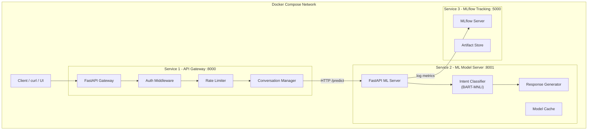

<p align="center">
  <h1 align="center">🤖 BYOAI - Conversational AI Automation System</h1>
  <p align="center">
    A production-grade microservices architecture for conversational AI with intent classification, experiment tracking, and containerized deployment.
  </p>
</p>

<p align="center">
  
  
  
  
  
  
</p>

---

## 📋 Table of Contents

- [Overview](#-overview)
- [Architecture](#-architecture)
- [Tech Stack](#-tech-stack)
- [Quick Start](#-quick-start)
- [API Documentation](#-api-documentation)
- [Development Setup](#-development-setup)
- [Data Pipeline](#-data-pipeline)
- [Experiment Tracking](#-experiment-tracking)
- [Testing](#-testing)
- [Project Structure](#-project-structure)
- [Design Decisions & Trade-offs](#-design-decisions--trade-offs)
- [Future Improvements](#-future-improvements)
- [Video Walkthrough](#-video-walkthrough)
- [License](#-license)

---

## 🌟 Overview

**BYOAI** (Build Your Own AI) is an end-to-end conversational automation system designed to demonstrate modern ML engineering practices. It processes natural language messages, classifies user intent using a zero-shot transformer model, and generates contextual responses - all within a fully containerized microservices architecture.

### Key Features

- 🧠 **Zero-Shot Intent Classification** - Uses `facebook/bart-large-mnli` for accurate intent detection without task-specific training data
- 🏗️ **Microservices Architecture** - Independently deployable API gateway and ML model server
- 📊 **Experiment Tracking** - Full MLflow integration for logging metrics, parameters, and model artifacts
- 🔄 **Data Pipeline** - Preprocessing, tokenization, and fine-tuning scripts for model customization
- 🐳 **One-Command Deployment** - Docker Compose with health checks, networking, and volume management
- 🔒 **Production Patterns** - Rate limiting, structured logging, circuit breaker, and graceful error handling
- 📖 **Auto-Generated API Docs** - Interactive Swagger UI via FastAPI's built-in OpenAPI support

---

## 🏛️ Architecture



### Design Decisions

| Decision | Rationale |
|---|---|
| **FastAPI for both services** | Async support, auto OpenAPI docs, type safety with Pydantic, best-in-class Python performance |
| **BART-MNLI for intent classification** | Zero-shot capability - works out-of-the-box without training data, strong accuracy on diverse intents |
| **Separate ML service** | Independent scaling, model hot-swap without gateway downtime, GPU isolation when needed |
| **MLflow as a 3rd service** | Centralized experiment tracking, model registry, reproducibility across team |
| **Docker Compose networking** | Service discovery via DNS, isolated networking, single-command deploy |
| **In-memory conversation store** | Zero infrastructure overhead for demo; architecture supports trivial swap to Redis/PostgreSQL |

---

## 🛠️ Tech Stack

| Technology | Role |
|---|---|
| **Python 3.11** | Core runtime for all services |
| **FastAPI** | High-performance async web framework for API gateway and ML server |
| **HuggingFace Transformers** | Pre-trained model loading, zero-shot classification pipeline |
| **facebook/bart-large-mnli** | Zero-shot NLI model for intent classification |
| **Pydantic v2** | Request/response validation, settings management |
| **httpx** | Async HTTP client for inter-service communication |
| **MLflow** | Experiment tracking, metric logging, model registry |
| **Docker & Docker Compose** | Containerization, orchestration, networking |
| **pytest** | Unit and integration testing |
| **Uvicorn** | ASGI server for production-grade serving |

---

## 🚀 Quick Start

### Prerequisites

- [Docker](https://docs.docker.com/get-docker/) >= 20.10
- [Docker Compose](https://docs.docker.com/compose/install/) >= 2.0
- [Git](https://git-scm.com/) (for auto-update feature)
- (Optional) NVIDIA GPU + drivers for GPU-accelerated inference

### Windows - One-Click Setup (Recommended)

The project includes automation scripts that handle everything for you:

| Script | Description |
|--------|-------------|
| **`run.bat`** | Full auto-start: pulls latest code from GitHub, starts Docker Desktop if not running, lets you choose CPU or GPU mode, builds & starts all containers, waits for health checks, and opens all browser UIs |
| **`install.bat`** | Verifies Docker & Docker Compose are installed, builds all Docker images from scratch |
| **`repair.bat`** | Stops everything, removes old images/volumes, rebuilds from scratch with `--no-cache`, then restarts |
| **`uninstall.bat`** | Full cleanup: stops containers, removes images, deletes volumes (model cache, mlflow data), prunes dangling resources |

```powershell
# Clone the repository
git clone https://github.com/divyprj/BYOAI.git
cd BYOAI

# Run everything with a single double-click or:
.\run.bat
```

`run.bat` will:
1. Pull the latest code from GitHub
2. Start Docker Desktop automatically (if not already running)
3. Ask you to choose **CPU** or **NVIDIA GPU** mode
4. Build and start all 3 microservice containers
5. Wait for the ML model to load and become healthy
6. Open **Gateway Swagger UI**, **ML Service Swagger UI**, and **MLflow Dashboard** in your browser

> **First run** takes 3-5 minutes as the ML service downloads the BART-MNLI model (~1.6 GB). Subsequent starts use the cached model via Docker volumes.

### Linux / macOS - Docker Compose

```bash
git clone https://github.com/divyprj/BYOAI.git
cd BYOAI
docker compose up --build
```

### GPU Mode (Optional)

If you have an NVIDIA GPU and want faster inference (~0.05s vs ~2s per request):

```bash
# Linux / macOS
docker compose -f docker-compose.yml -f docker-compose.gpu.yml up --build

# Windows
.\run.bat    # then select option [2] for GPU
```

> Requires NVIDIA drivers, Docker with WSL2 backend (Windows), and the NVIDIA Container Toolkit.

### What to Expect

Once all services are healthy:

| Service | URL | Description |
|---|---|---|
| **API Gateway** | [http://localhost:8000](http://localhost:8000) | Main conversational API |
| **Gateway Docs** | [http://localhost:8000/docs](http://localhost:8000/docs) | Interactive Swagger UI |
| **ML Service** | [http://localhost:8001](http://localhost:8001) | Model inference service |
| **ML Docs** | [http://localhost:8001/docs](http://localhost:8001/docs) | ML service Swagger UI |
| **MLflow UI** | [http://localhost:5000](http://localhost:5000) | Experiment tracking dashboard |

### Try It Out

```bash
# Send a message
curl -s -X POST http://localhost:8000/api/v1/chat \
  -H "Content-Type: application/json" \
  -d '{"message": "Hello! How are you?", "session_id": "demo"}' | python -m json.tool

# Run integration tests
pip install httpx
python scripts/test_api.py
```

---

## 📡 API Documentation

### `POST /api/v1/chat`

Send a message and receive an intent-classified response.

**Request:**
```bash
curl -X POST http://localhost:8000/api/v1/chat \
  -H "Content-Type: application/json" \
  -d '{
    "message": "I would like to book an appointment for next week",
    "session_id": "user-123"
  }'
```

**Response:**
```json
{
  "session_id": "user-123",
  "message": "I would like to book an appointment for next week",
  "intent": "booking",
  "confidence": 0.92,
  "response": "I'd be happy to help you with your booking! Let me check available slots for you.",
  "all_intents": {
    "booking": 0.92,
    "question": 0.04,
    "help": 0.02,
    "greeting": 0.01,
    "complaint": 0.01
  },
  "processing_time_ms": 145.3
}
```

### `GET /api/v1/history/{session_id}`

Retrieve conversation history for a session.

**Request:**
```bash
curl http://localhost:8000/api/v1/history/user-123
```

**Response:**
```json
{
  "session_id": "user-123",
  "history": [
    {
      "role": "user",
      "message": "I would like to book an appointment for next week",
      "timestamp": "2025-01-15T10:30:00Z"
    },
    {
      "role": "assistant",
      "message": "I'd be happy to help you with your booking!",
      "intent": "booking",
      "confidence": 0.92,
      "timestamp": "2025-01-15T10:30:01Z"
    }
  ]
}
```

### `DELETE /api/v1/history/{session_id}`

Clear conversation history for a session.

**Request:**
```bash
curl -X DELETE http://localhost:8000/api/v1/history/user-123
```

**Response:**
```json
{
  "session_id": "user-123",
  "message": "Conversation history cleared",
  "cleared_count": 2
}
```

### `GET /health`

Gateway liveness check.

**Request:**
```bash
curl http://localhost:8000/health
```

**Response:**
```json
{
  "status": "healthy",
  "service": "byoai-gateway",
  "timestamp": "2025-01-15T10:30:00Z"
}
```

### `GET /health/ready`

Gateway readiness check - verifies ML service connectivity.

**Request:**
```bash
curl http://localhost:8000/health/ready
```

**Response:**
```json
{
  "status": "ready",
  "service": "byoai-gateway",
  "ml_service": "connected",
  "model_loaded": true,
  "timestamp": "2025-01-15T10:30:00Z"
}
```

---

## 💻 Development Setup

### Local Development (Without Docker)

#### 1. ML Service

```bash
cd ml_service
python -m venv .venv
source .venv/bin/activate       # Windows: .venv\Scripts\activate
pip install -r requirements.txt

# Start the ML service on port 8001
uvicorn app.main:app --host 0.0.0.0 --port 8001 --reload
```

#### 2. API Gateway

```bash
cd gateway
python -m venv .venv
source .venv/bin/activate       # Windows: .venv\Scripts\activate
pip install -r requirements.txt

# Set the ML service URL
export GATEWAY_ML_SERVICE_URL=http://localhost:8001   # Windows: set GATEWAY_ML_SERVICE_URL=http://localhost:8001

# Start the gateway on port 8000
uvicorn app.main:app --host 0.0.0.0 --port 8000 --reload
```

#### 3. MLflow Server

```bash
pip install mlflow
mlflow server --host 0.0.0.0 --port 5000 --backend-store-uri sqlite:///mlflow.db --default-artifact-root ./mlartifacts
```

### Environment Variables

Copy the example environment file and customize:

```bash
cp .env.example .env
```

See [`.env.example`](.env.example) for all available configuration options.

---

## 🔄 Data Pipeline

The data pipeline provides end-to-end preprocessing and fine-tuning capabilities for custom intent models.

### 1. Preprocessing

```bash
cd data_pipeline
pip install -r requirements.txt

# Run preprocessing on the sample dataset
python preprocess.py
```

This will:
- Clean and normalize text data from `sample_data/intents.json`
- Tokenize using the HuggingFace tokenizer
- Create stratified train/val/test splits (80/10/10)
- Save processed datasets to `processed/`

### 2. Fine-Tuning

```bash
# Fine-tune a DistilBERT model on the processed data
python fine_tune.py \
  --model_name distilbert-base-uncased \
  --epochs 10 \
  --batch_size 16 \
  --learning_rate 2e-5
```

This uses the HuggingFace `Trainer` API with:
- Early stopping based on validation loss
- Best model checkpoint saving
- Evaluation metrics during training

### Sample Data Format

```json
[
  {
    "text": "Hello, how are you?",
    "intent": "greeting"
  },
  {
    "text": "I want to book a table for two",
    "intent": "booking"
  }
]
```

### Supported Intents

| Intent | Description | Example |
|---|---|---|
| `greeting` | Friendly hello/hi messages | "Hey there! How's it going?" |
| `farewell` | Goodbye messages | "Thanks, bye!" |
| `question` | General information queries | "What are your business hours?" |
| `complaint` | Customer complaints | "My order arrived damaged" |
| `booking` | Reservation/appointment requests | "Book a table for 2 at 7pm" |
| `feedback` | Customer feedback/reviews | "Great service, loved it!" |
| `help` | Help/support requests | "Can someone help me?" |
| `out_of_scope` | Unrelated messages | "What's the meaning of life?" |

---

## 📊 Experiment Tracking

### MLflow Integration

BYOAI uses MLflow for comprehensive experiment tracking. The MLflow server runs as a containerized service alongside the gateway and ML service.

### Running Experiments

```bash
cd experiments
pip install -r requirements.txt

# Run training with MLflow tracking
export MLFLOW_TRACKING_URI=http://localhost:5000
python train_and_track.py
```

### What Gets Tracked

| Category | Metrics |
|---|---|
| **Hyperparameters** | Learning rate, batch size, epochs, model name, max sequence length |
| **Training Metrics** | Training loss, validation loss (per epoch) |
| **Evaluation Metrics** | Accuracy, Precision, Recall, F1 (macro + per-class) |
| **Artifacts** | Trained model, tokenizer, confusion matrix, classification report |

### Evaluation

```bash
# Run standalone evaluation
python evaluate.py --model_path ./best_model --test_data ../data_pipeline/processed/test
```

This generates:
- Confusion matrix (saved as artifact)
- Per-class precision, recall, F1
- Overall accuracy and macro-averaged metrics
- All metrics logged to MLflow

### Viewing Results

Open the MLflow UI at [http://localhost:5000](http://localhost:5000) to:
- Compare experiment runs side-by-side
- View training curves and metric plots
- Download model artifacts
- Register models for deployment

---

## 🧪 Testing

### Unit Tests

```bash
# Gateway unit tests
cd gateway
pip install -r requirements.txt
pytest tests/ -v

# ML Service unit tests
cd ml_service
pip install -r requirements.txt
pytest tests/ -v
```

### Integration Tests

```bash
# Make sure services are running
docker compose up -d

# Wait for health checks to pass, then run
python scripts/test_api.py
```

The integration test suite covers:
1. ✅ Gateway health check
2. ✅ Readiness check (ML service connectivity)
3. ✅ Greeting intent classification
4. ✅ Complaint intent classification
5. ✅ Booking intent classification
6. ✅ Conversation history retrieval
7. ✅ Out-of-scope message handling
8. ✅ History clearing
9. ✅ History cleared verification

### Quick Demo

```bash
bash scripts/demo.sh
```

---

## 📁 Project Structure

```
BYOAI/
├── README.md                        # This file
├── docker-compose.yml               # Multi-service orchestration (CPU)
├── docker-compose.gpu.yml           # GPU override (NVIDIA CUDA)
├── .env.example                     # Environment variable template
├── .gitignore                       # Git ignore rules
│
├── run.bat                          # One-click start (auto Docker, GPU/CPU, browser)
├── install.bat                      # Build all Docker images
├── repair.bat                       # Full rebuild (no-cache)
├── uninstall.bat                    # Complete cleanup
│
├── gateway/                         # Service 1: API Gateway (:8000)
│   ├── Dockerfile
│   ├── requirements.txt
│   ├── app/
│   │   ├── __init__.py
│   │   ├── main.py                  # FastAPI app, lifespan, CORS
│   │   ├── config.py                # Settings via pydantic-settings
│   │   ├── models.py                # Pydantic request/response schemas
│   │   ├── routes/
│   │   │   ├── __init__.py
│   │   │   ├── conversation.py      # /chat, /history endpoints
│   │   │   └── health.py            # /health, /ready
│   │   ├── services/
│   │   │   ├── __init__.py
│   │   │   ├── ml_client.py         # Async HTTP client to ML service
│   │   │   └── conversation.py      # In-memory conversation state
│   │   └── middleware/
│   │       ├── __init__.py
│   │       ├── rate_limiter.py       # Token-bucket rate limiter
│   │       └── logging.py           # Structured JSON logging
│   └── tests/
│       ├── __init__.py
│       └── test_gateway.py          # Unit tests
│
├── ml_service/                      # Service 2: ML Model Server (:8001)
│   ├── Dockerfile                   # CPU image (python:3.11-slim)
│   ├── Dockerfile.gpu               # GPU image (nvidia/cuda + Python)
│   ├── requirements.txt             # CPU dependencies
│   ├── requirements.gpu.txt         # GPU dependencies (PyTorch + CUDA)
│   ├── app/
│   │   ├── __init__.py
│   │   ├── main.py                  # FastAPI app
│   │   ├── config.py                # ML service settings
│   │   ├── models.py                # Pydantic schemas
│   │   ├── routes/
│   │   │   ├── __init__.py
│   │   │   ├── predict.py           # /predict endpoint
│   │   │   └── health.py            # /health endpoint
│   │   └── services/
│   │       ├── __init__.py
│   │       ├── intent_classifier.py # Zero-shot classification
│   │       └── response_generator.py# Template-based responses
│   └── tests/
│       ├── __init__.py
│       └── test_ml_service.py       # Unit tests
│
├── data_pipeline/                   # Data Pipeline & Preprocessing
│   ├── requirements.txt
│   ├── preprocess.py                # Data cleaning, tokenization, splits
│   ├── fine_tune.py                 # Fine-tuning with HuggingFace Trainer
│   └── sample_data/
│       └── intents.json             # Sample intent dataset (~200 examples)
│
├── experiments/                     # Experiment Tracking
│   ├── requirements.txt
│   ├── train_and_track.py           # MLflow experiment runner
│   ├── evaluate.py                  # Evaluation metrics & confusion matrix
│   └── mlflow/
│       └── Dockerfile               # MLflow server image
│
└── scripts/
    ├── test_api.py                  # End-to-end API integration tests
    └── demo.sh                      # Quick demo script
```

---

## 🎯 Design Decisions & Trade-offs

### Why Zero-Shot Classification?

| Approach | Pros | Cons |
|---|---|---|
| **Zero-shot (chosen)** | No training data needed, works immediately, handles new intents by adding labels | Slightly lower accuracy than fine-tuned, larger model size |
| **Fine-tuned DistilBERT** | Higher accuracy, smaller model, faster inference | Requires labeled training data, retraining for new intents |
| **Rule-based / Regex** | Fast, no ML overhead | Brittle, poor generalization, high maintenance |

**Decision:** Zero-shot for the live system (immediate value), fine-tuning scripts provided for production optimization.

### Why In-Memory Storage?

| Approach | Pros | Cons |
|---|---|---|
| **In-memory (chosen)** | Zero infrastructure overhead, simple deployment, fast | Data lost on restart, not horizontally scalable |
| **Redis** | Persistent, fast, pub/sub support | Additional container, configuration |
| **PostgreSQL** | Full ACID, complex queries | Heavy for a demo, ORM setup |

**Decision:** In-memory for demo simplicity. The `ConversationManager` interface is designed for easy swap to Redis/PostgreSQL.

### Why Separate Services?

- **Independent Scaling** - ML inference is CPU/GPU-intensive; scale it independently from the lightweight gateway
- **Model Hot-Swap** - Update the ML model without any gateway downtime
- **Technology Flexibility** - ML service could be rewritten in a different framework (e.g., TorchServe, Triton) without affecting the gateway
- **GPU Isolation** - When GPU support is added, only the ML service container needs GPU access

### Why FastAPI?

- **Performance** - Among the fastest Python web frameworks (on par with Node.js/Go for I/O-bound workloads)
- **Type Safety** - Pydantic integration catches data issues at the boundary
- **Auto Documentation** - Swagger UI and ReDoc generated automatically from type annotations
- **Async Support** - Native `async/await` for non-blocking I/O (critical for the gateway's HTTP client calls)

---

## 🔮 Future Improvements

- [ ] **Redis/PostgreSQL** - Persistent conversation storage with session expiry
- [ ] **Authentication & API Keys** - JWT-based auth with API key management
- [x] **GPU Support** - NVIDIA CUDA integration with `docker-compose.gpu.yml` for GPU-accelerated inference
- [ ] **CI/CD Pipeline** - GitHub Actions for automated testing, building, and deployment
- [ ] **Kubernetes Deployment** - Helm charts for production-grade orchestration
- [ ] **Prometheus + Grafana** - Metrics collection and monitoring dashboards
- [ ] **WebSocket Support** - Real-time streaming responses
- [ ] **Model A/B Testing** - Canary deployments with traffic splitting
- [ ] **Response Caching** - Redis-based caching for identical queries
- [ ] **Multi-language Support** - Multilingual intent classification models
- [ ] **Frontend UI** - React/Next.js chat interface

---

## 🎬 Video Walkthrough

> _A video walkthrough demonstrating the full system is available at: **[Coming Soon]**_

### Demo Talking Points

1. **Architecture Overview** - Show the `docker-compose.yml` and explain the 3-service design
2. **One-Command Deploy** - Run `docker compose up --build` and watch services come online
3. **Health Checks** - Demonstrate health and readiness endpoints
4. **Live Chat Demo** - Send various messages (greeting, complaint, booking) and show intent classification
5. **Conversation History** - Show session management with history retrieval and clearing
6. **Swagger UI** - Walk through the auto-generated API documentation at `/docs`
7. **MLflow Dashboard** - Show experiment tracking at `localhost:5000`
8. **Data Pipeline** - Run preprocessing and demonstrate the fine-tuning workflow
9. **Code Walkthrough** - Highlight key architectural patterns (circuit breaker, rate limiter, zero-shot pipeline)
10. **Future Roadmap** - Discuss production scaling with Kubernetes, GPU support, and CI/CD

### Quick Demo Commands

```bash
# Start everything
docker compose up --build -d

# Wait for services to be healthy
docker compose ps

# Run the demo script
bash scripts/demo.sh

# Run integration tests
python scripts/test_api.py

# View MLflow UI
open http://localhost:5000

# Tear down
docker compose down -v
```

---

## 📄 License

This project is licensed under the **MIT License**.

```
MIT License

Copyright (c) 2025 BYOAI

Permission is hereby granted, free of charge, to any person obtaining a copy
of this software and associated documentation files (the "Software"), to deal
in the Software without restriction, including without limitation the rights
to use, copy, modify, merge, publish, distribute, sublicense, and/or sell
copies of the Software, and to permit persons to whom the Software is
furnished to do so, subject to the following conditions:

The above copyright notice and this permission notice shall be included in all
copies or substantial portions of the Software.

THE SOFTWARE IS PROVIDED "AS IS", WITHOUT WARRANTY OF ANY KIND, EXPRESS OR
IMPLIED, INCLUDING BUT NOT LIMITED TO THE WARRANTIES OF MERCHANTABILITY,
FITNESS FOR A PARTICULAR PURPOSE AND NONINFRINGEMENT. IN NO EVENT SHALL THE
AUTHORS OR COPYRIGHT HOLDERS BE LIABLE FOR ANY CLAIM, DAMAGES OR OTHER
LIABILITY, WHETHER IN AN ACTION OF CONTRACT, TORT OR OTHERWISE, ARISING FROM,
OUT OF OR IN CONNECTION WITH THE SOFTWARE OR THE USE OR OTHER DEALINGS IN THE
SOFTWARE.
```

---

<p align="center">
  Built with ❤️ using FastAPI, HuggingFace Transformers, and Docker
</p>
